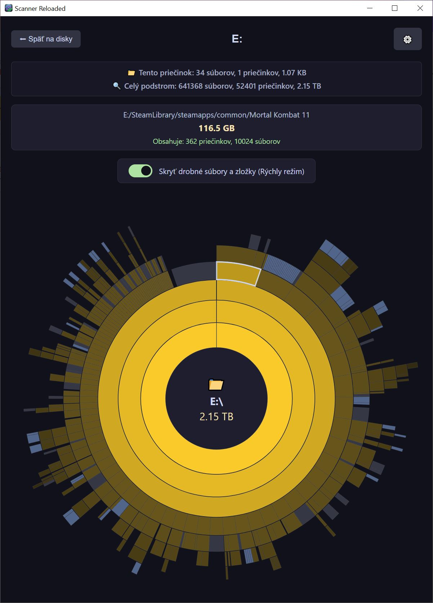
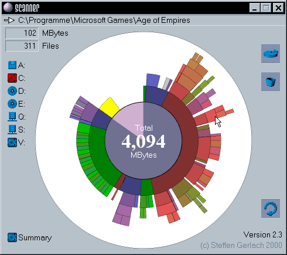

# Scanner Reloaded 🔍📊

A modern, fast, and cross-platform disk space visualizer built with Tauri, Rust, and D3.js.



This project is a tribute to and a modern remake of the classic "Scanner" utility by Steffen Gerlach. The original tool provided a simple yet powerful sunburst chart to visualize disk usage, which was an inspiration for this application.



You can find more about the original author and his work here: [www.steffengerlach.de](http://www.steffengerlach.de/freeware/index.html)

## Features

- **Fast Analysis**: Leverages Rust's performance for quick, multi-threaded scanning of your drives.
- **Interactive Sunburst Chart**: Uses D3.js to create a beautiful and interactive visualization of your file system.
- **Cross-Platform**: Built with Tauri to run on Windows, macOS, and Linux.
- **Modern UI**: A clean, responsive, and lightweight user interface made with vanilla HTML, CSS, and JavaScript.
- **Performance Filtering**: Smooth 60 FPS rendering by automatically filtering out microscopic files during zoom.

## Tech Stack

- **[Tauri v2](https://tauri.app/)**: The core framework for building the cross-platform desktop application.
- **[Rust](https://www.rust-lang.org/)**: Powers the backend for high-performance directory traversal.
- **[D3.js v7](https://d3js.org/)**: Used for creating the interactive Sunburst Partition layout.
- **Vanilla JS / HTML / CSS**: For a lightweight and dependency-free frontend.

> ### 🧠 Built with AI & Vibe Coding
>
> This project is a proud product of **Vibe Coding**! 🚀
>
> It was built in active collaboration with **Google Gemini**, showcasing how modern AI-guided development can rapidly prototype and deliver a high-performance desktop application, merging a Rust backend with a smooth D3.js frontend visualization.

## Recommended IDE Setup

- [VS Code](https://code.visualstudio.com/) + [Tauri Extension](https://marketplace.visualstudio.com/items?itemName=tauri-apps.tauri-vscode) + [rust-analyzer](https://marketplace.visualstudio.com/items?itemName=rust-lang.rust-analyzer)

## Getting Started

### Prerequisites

Ensure you have the following installed on your system:
- [Node.js](https://nodejs.org/) (LTS)
- [Rust & Cargo](https://www.rust-lang.org/)
- System dependencies for Tauri (see the official [Tauri Prerequisites Guide](https://tauri.app/v2/guides/prerequisites/))

### Installation

1. Clone the repository:
   ```bash
   git clone [https://github.com/majrooo/scanner-reloaded.git](https://github.com/majrooo/scanner-reloaded.git)
   cd scanner-reloaded
  ```

2. Install frontend dependencies:
   ```bash
   npm install
   ```

### Development

To start the application in development mode with live-reloading:
```bash
npm run tauri dev
```

### Build

To compile a highly optimized, production-ready native executable for your platform:
```bash
npm run tauri build
```

The installer package will be generated in the `src-tauri/target/release/bundle/` directory.

## License

This project is open-source and available under the [MIT License](LICENSE.txt).