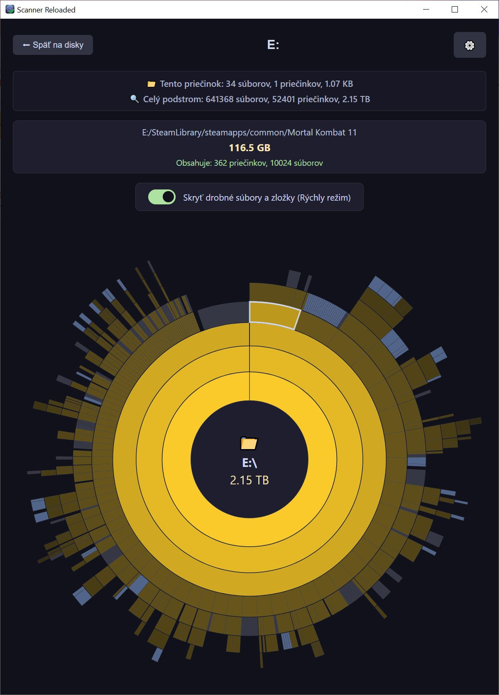
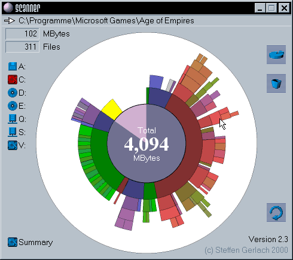

# Scanner Reloaded 🔍📊


A modern, fast, and cross-platform disk space visualizer built with Tauri, Rust, and D3.js.



> ### 🖥️ Platform status
> **Windows** – the most tested platform, recommended (installer + portable)
> **macOS** – builds available (DMG/portable), but **not yet tested** on real hardware
> **Linux** – builds available (AppImage/portable), but **not yet tested** – especially on different distros/desktops
>
> **Help wanted!** If you're on Linux or macOS, please try the build and report any issues → [GitHub Issues](https://github.com/Majrooo/scanner-reloaded/issues)

This project is a tribute to and a modern remake of the classic "Scanner" utility by Steffen Gerlach. The original tool provided a simple yet powerful sunburst chart to visualize disk usage, which was an inspiration for this application.



You can find more about the original author and his work here: [www.steffengerlach.de](http://www.steffengerlach.de/freeware/index.html)

## Download

Get the latest version (**v0.3.0**) for your platform from the [Releases page](https://github.com/Majrooo/scanner-reloaded/releases).

| Platform | Installer | Portable |
|----------|-----------|----------|
| **Windows** ✅ | `Scanner.Reloaded_0.3.0_x64-setup.exe` (NSIS) or `Scanner.Reloaded_0.3.0_x64_en-US.msi` | – (coming in next release) |
| **macOS** ⚠️ | `Scanner.Reloaded_0.3.0_aarch64.dmg` (Apple Silicon) | `Scanner.Reloaded_aarch64.app.tar.gz` |
| **Linux** ⚠️ | `Scanner.Reloaded_0.3.0_amd64.AppImage` (also `.deb`, `.rpm`) | – (coming in next release) |

> **Tip:** Portable version requires no installation — just extract and run.

> ⚠️ **macOS/Linux builds are early versions** — they compile and are available, but haven't been tested on real hardware yet. Windows is the primary tested platform. Please report any issues! Portable builds for Windows and Linux will be attached to the next release.

## Testing status

| Platform | Status |
|----------|--------|
| Windows x64 | ✅ Tested (NSIS, MSI, portable) |
| macOS | ⚠️ Early build – needs testing |
| Linux | ⚠️ Early build – needs testing |

Need help? Try the **Linux AppImage** or **macOS DMG** and report any issues → [GitHub Issues](https://github.com/Majrooo/scanner-reloaded/issues)

## Features

- **Fast Analysis**: Leverages Rust's performance for quick, multi-threaded scanning of your drives.
- **Interactive Sunburst Chart**: Uses D3.js to create a beautiful and interactive visualization of your file system.
- **Cross-Platform**: Built with Tauri — Windows is fully tested; Linux & macOS builds available as early versions.
- **Modern UI**: A clean, responsive, and lightweight user interface made with vanilla HTML, CSS, and JavaScript.
- **Performance Filtering**: Smooth 60 FPS rendering by automatically filtering out microscopic files during zoom.
- **Internationalization (i18n)**: Supports multiple languages (English and Slovak) with settings persisted locally.

## Tech Stack

- **[Tauri v2](https://tauri.app/)**: The core framework for building the cross-platform desktop application.
- **[Rust](https://www.rust-lang.org/)**: Powers the backend for high-performance directory traversal.
- **[D3.js v7](https://d3js.org/)**: Used for creating the interactive Sunburst Partition layout.
- **Vanilla JS / HTML / CSS**: For a lightweight and dependency-free frontend.

> ### 🧠 Built with AI & Vibe Coding
>
>This project is a proud product of **Vibe Coding**! 🚀
>
> This project began in collaboration with **Google Gemini** and continues as a hands-on project for gaining experience and skills in AI-assisted programming. It serves as a practical example of how AI tools can accelerate development, from backend logic in Rust to frontend visualization with D3.js.

## Recommended IDE Setup

- [VS Code](https://code.visualstudio.com/) + [Tauri Extension](https://marketplace.visualstudio.com/items?itemName=tauri-apps.tauri-vscode) + [rust-analyzer](https://marketplace.visualstudio.com/items?itemName=rust-lang.rust-analyzer)

## Getting Started

### Prerequisites

Ensure you have the following installed on your system:
- [Node.js](https://nodejs.org/) (LTS)
- [Rust & Cargo](https://www.rust-lang.org/)
- System dependencies for Tauri (see the official [Tauri Prerequisites Guide](https://tauri.app/v2/guides/prerequisites/))

### Installation

1. Clone the repository:
   ```bash
   git clone https://github.com/majrooo/scanner-reloaded.git
   cd scanner-reloaded
   ```
2. Install frontend dependencies:
   ```bash
   npm install
   ```

### Development

To start the application in development mode with live-reloading:
```bash
npm run tauri dev
```

### Build

To compile a highly optimized, production-ready native executable for your platform:
```bash
npm run tauri build
```

The installer package will be generated in the `src-tauri/target/release/bundle/` directory.

## License

This project is open-source and available under the [MIT License](LICENSE.txt).